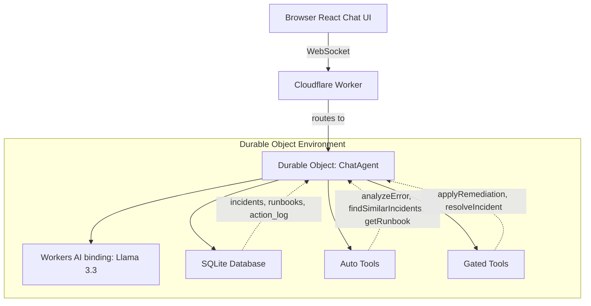

# Incident Triage Agent

An AI-powered incident triage agent deployed on Cloudflare that fast-tracks job-application troubleshooting by analyzing stack traces, proposing runbook remediations, and continuously learning from resolved incidents.

**Live Demo URL**: [https://agent-starter.agent-starter.workers.dev](https://agent-starter.agent-starter.workers.dev)
*(Open in an Incognito window to avoid browser caching or auth token issues)*

## Architecture



| Requirement | Implementation |
|---|---|
| **LLM** | Llama 3.3 on Workers AI (`@cf/meta/llama-3.3-70b-instruct-fp8-fast`) |
| **Workflow / Coordination** | Agents SDK (Durable Object) managing a multi-step tool pipeline |
| **User Input** | Custom React Chat UI streaming from `agents-starter` |
| **Memory / State** | DO SQLite (`this.sql`) for persistent incident and runbook memory |

## Approval Gate Mechanics

By design, the LLM **proposes** actions but deterministic code **executes** them.
When the AI wants to run a mutating action (`applyRemediation` or `resolveIncident`), it encounters a tool with `needsApproval: true`. 
1. The execution pauses on the server.
2. The UI receives an `approval-requested` state and renders a visually distinct summary card (e.g. a purple "SIMULATED" badge for remediations).
3. The human operator clicks **Approve** or **Reject**.
4. Only upon explicit approval does the server-side `execute()` function run. Even then, `execute()` validates the input safely before performing any database insertions via an idempotency key (`action_log`). 

## Data Model & Learning Loop

- **Signal Extraction (`analyzeError`)**: Normalizes error traces by redacting secrets and stripping timestamps, yielding a unique `signature`. It opens an incident in the SQLite database to track the triage session.
- **Matching (`findSimilarIncidents`)**: Uses Jaccard similarity scoring to rank past resolved incidents. Only verified `resolved` incidents are matched.
- **Merge/Learning Loop (`resolveIncident`)**: Upon successful resolution, if the new error shares the same signature as a past one, it simply increments the past incident's `success_count` and marks the new incident as `merged`. Otherwise, it resolves it as a brand new learned pattern.

## Local Development & Deployment

### Run Locally
```bash
# Install dependencies
npm install

# Run the local development server (Durable Objects run locally)
npm run dev
```

### Deploy to Cloudflare
```bash
# Deploy your worker to the edge
npx wrangler deploy
```

## Limitations & Next Steps

1. **Semantic Search (Vectorize)**: The current implementation uses pure TypeScript keyword scoring (Jaccard similarity). To improve this, we can integrate Cloudflare Vectorize to find semantically similar root causes.
2. **Cloudflare Workflows**: Migrate the sequential triage steps into a persistent Cloudflare Workflow for built-in retries and durable execution in case the DO gets evicted.
3. **Webhook Integration**: Add a generic `POST /alert` endpoint to allow tools like PagerDuty to automatically spawn a triage session, instead of requiring manual paste-ins.

---
**Prompt History**: See [PROMPTS.md](PROMPTS.md) for the realistic prompt history used to construct this project.
