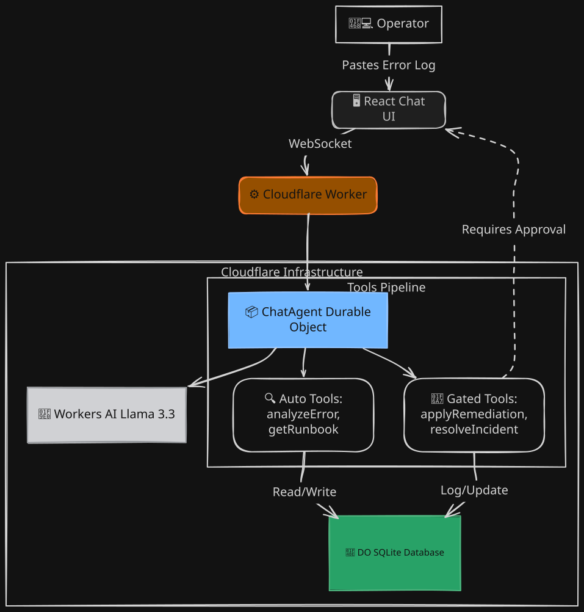

# Incident Triage Agent 🚨


An AI-powered incident triage agent deployed on Cloudflare that fast-tracks troubleshooting by intelligently analyzing stack traces, proposing runbook remediations, and continuously learning from resolved incidents.

Built for scale, speed, and safety using the **Cloudflare Agents SDK**, **Workers AI**, and **Durable Objects**.

**Live Demo**: [https://agent-starter.agent-starter.workers.dev](https://agent-starter.agent-starter.workers.dev)  
_(Open in an Incognito window to avoid browser caching or auth token issues)_

---

## ✨ Features

- **Automated Root Cause Analysis**: Paste an error log and let the Llama 3.3 model analyze and extract critical signals (service name, error type, keywords).
- **Intelligent Incident Matching**: Recommends fixes by matching the current issue with past resolved incidents using a custom Jaccard similarity scoring algorithm.
- **Human-in-the-Loop Approval**: The AI proposes remediations (e.g. `restart_service`, `rollback_deploy`), but deterministic code executes them only after explicit human approval.
- **Continuous Learning Loop**: Successfully resolved incidents are stored in a persistent SQLite database (via Durable Objects). The agent learns from them to better triage future issues!
- **Zero-Hallucination Execution**: Tools are strictly validated. Read-only actions are automated, while mutating actions are simulated and safely gated.

## 🏗️ Architecture



| Requirement                 | Implementation                                                       |
| --------------------------- | -------------------------------------------------------------------- |
| **LLM Inference**           | Llama 3.3 on Workers AI (`@cf/meta/llama-3.3-70b-instruct-fp8-fast`) |
| **Workflow / Coordination** | Agents SDK (Durable Object) managing a multi-step tool pipeline      |
| **User Interface**          | Custom React Chat UI streaming from `agents-starter`                 |
| **Memory / State**          | DO SQLite (`this.sql`) for persistent incident and runbook memory    |

## 🛡️ The Approval Gate

By design, the LLM **proposes** actions but deterministic code **executes** them. When the AI wants to run a mutating action (`applyRemediation` or `resolveIncident`), it encounters a tool with `needsApproval: true`.

1. The execution pauses on the server.
2. The UI receives an `approval-requested` state and renders a visually distinct summary card (e.g., a "SIMULATED" badge for remediations).
3. The human operator clicks **Approve** or **Reject**.
4. Only upon explicit approval does the server-side `execute()` function run. Even then, `execute()` validates the input safely before performing any database insertions via an idempotency key (`action_log`).

## 🚀 Local Development & Deployment

### Run Locally

```bash
# Install dependencies
npm install

# Run the local development server (Durable Objects run locally)
npm run dev
```

### Deploy to Cloudflare

```bash
# Deploy your worker to the edge
npm run deploy
```

## 🔮 Limitations & Next Steps

1. **Semantic Search (Vectorize)**: The current implementation uses pure TypeScript keyword scoring. To improve this, we can integrate Cloudflare Vectorize to find semantically similar root causes.
2. **Cloudflare Workflows**: Migrate the sequential triage steps into a persistent Cloudflare Workflow for built-in retries and durable execution in case the DO gets evicted.
3. **Webhook Integration**: Add a generic `POST /alert` endpoint to allow tools like PagerDuty to automatically spawn a triage session, instead of requiring manual paste-ins.

---

**Prompt History**: See [`PROMPTS.md`](PROMPTS.md) for the realistic prompt history used to construct this project.
